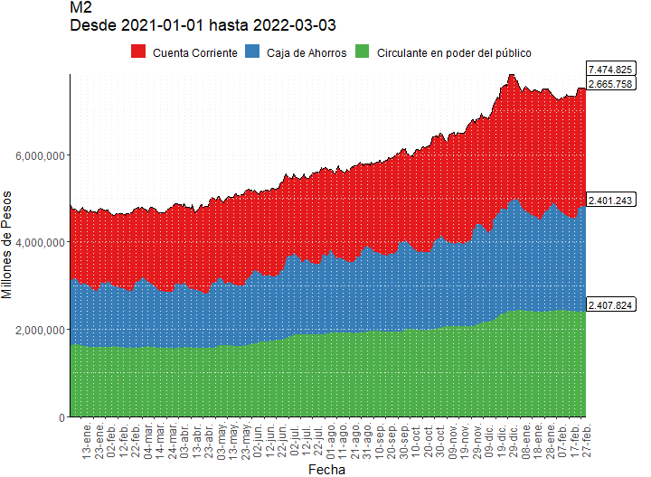
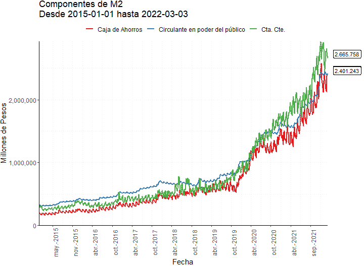
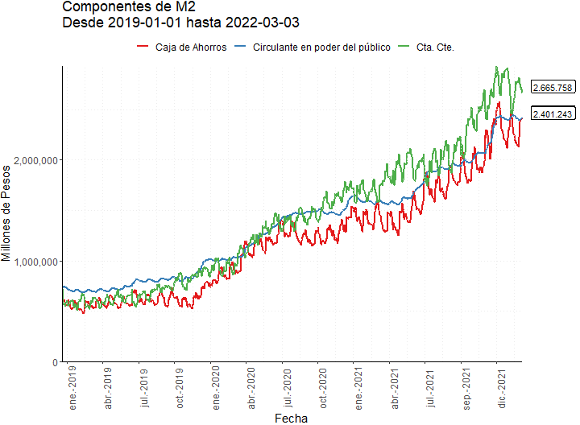
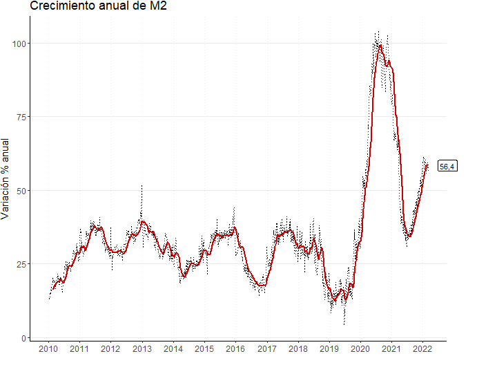
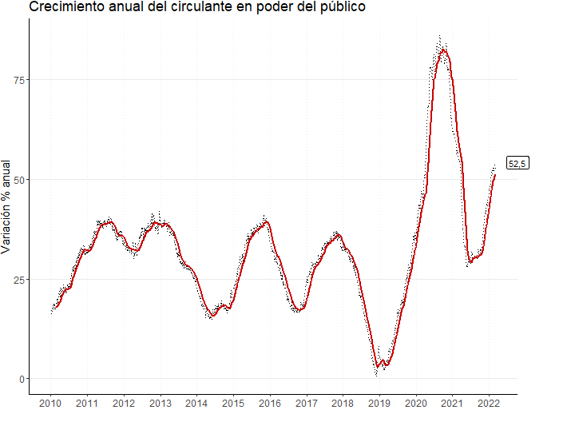

```{r setup, include=FALSE}
knitr::opts_chunk$set(echo = FALSE)
knitr::opts_knit$set(root.dir=normalizePath("."))
```

```{r eval=TRUE}
N <- 0
pag <- 2
```

## M2

<a id="M20"></a>

<br><br><br><br>

```{r eval=TRUE}
N <- N+1
link <- paste0("https://raw.githubusercontent.com/esterodr/Monitor_v2/main/CSV/Grafico",pag*100+N,".csv")
```
### `r paste0(pag,".",N)`
<br>


<br>**Nota:** Series Diarias
<br>[Descargar Datos](`r link`){target="_blank"}

<a id="M21"></a>

<br><br><br><br>

```{r eval=TRUE}
N <- N+1
link <- paste0("https://raw.githubusercontent.com/esterodr/Monitor_v2/main/CSV/Grafico",pag*100+N,".csv")
```
### `r paste0(pag,".",N)`
<br>


<br>**Nota:** Series Diarias
<br>[Descargar Datos](`r link`){target="_blank"}

<a id="M22"></a>

<br><br><br><br>

```{r eval=TRUE}
N <- N+1
link <- paste0("https://raw.githubusercontent.com/esterodr/Monitor_v2/main/CSV/Grafico",pag*100+N,".csv")
```
### `r paste0(pag,".",N)`
<br>


<br>**Nota:** Series Diarias
<br>[Descargar Datos](`r link`){target="_blank"}

<a id="M23"></a>

<br><br><br><br>

```{r eval=TRUE}
N <- N+1
link <- paste0("https://raw.githubusercontent.com/esterodr/Monitor_v2/main/CSV/Grafico",pag*100+N,".csv")
```
### `r paste0(pag,".",N)`
<br>


<br>**Nota:** Series Diarias
<br>[Descargar Datos](`r link`){target="_blank"}

<br><br><br><br>

## Componentes de M2

<a id="M2c0"></a>

<br><br><br><br>

```{r eval=TRUE}
N <- N+1
link <- paste0("https://raw.githubusercontent.com/esterodr/Monitor_v2/main/CSV/Grafico",pag*100+N,".csv")
```
### `r paste0(pag,".",N)`
<br>


<br>**Nota:** Series Diarias
<br>[Descargar Datos](`r link`){target="_blank"}

<a id="M2c1"></a>

<br><br><br><br>

```{r eval=TRUE}
N <- N+1
link <- paste0("https://raw.githubusercontent.com/esterodr/Monitor_v2/main/CSV/Grafico",pag*100+N,".csv")
```
### `r paste0(pag,".",N)`
<br>


<br>**Nota:** Series Diarias
<br>[Descargar Datos](`r link`){target="_blank"}

<a id="M2c2"></a>

<br><br><br><br>

```{r eval=TRUE}
N <- N+1
link <- paste0("https://raw.githubusercontent.com/esterodr/Monitor_v2/main/CSV/Grafico",pag*100+N,".csv")
```
### `r paste0(pag,".",N)`
<br>


<br>**Nota:** Series Diarias
<br>[Descargar Datos](`r link`){target="_blank"}

<a id="M2c3"></a>

<br><br><br><br>

```{r eval=TRUE}
N <- N+1
link <- paste0("https://raw.githubusercontent.com/esterodr/Monitor_v2/main/CSV/Grafico",pag*100+N,".csv")
```
### `r paste0(pag,".",N)`
<br>


<br>**Nota:** Series Diarias
<br>[Descargar Datos](`r link`){target="_blank"}

<br><br><br><br>

## M2 en términos reales y del PIB

<a id="M2_real"></a>

<br><br><br><br>

```{r eval=TRUE}
N <- N+1
link <- paste0("https://raw.githubusercontent.com/esterodr/Monitor_v2/main/CSV/Grafico",pag*100+N,".csv")
```
### `r paste0(pag,".",N)`
<br>


<br>**Nota:** Series Mensuales: promedio de datos diarios. Expresado a valores del último dato disponible.
<br>[Descargar Datos](`r link`){target="_blank"}

<a id="M2_pib1"></a>

<br><br><br><br>

```{r eval=TRUE}
N <- N+1
link <- paste0("https://raw.githubusercontent.com/esterodr/Monitor_v2/main/CSV/Grafico",pag*100+N,".csv")
```
### `r paste0(pag,".",N)`
<br>


<br>**Nota:** Series Mensuales. Los componentes de M2 corresponden al promedio de datos diarios. Los valores trimestrales del PIB se mensualizan mediante una interpolación cúbica.
<br>[Descargar Datos](`r link`){target="_blank"}

<a id="M2_pib2"></a>

<br><br><br><br>

```{r eval=TRUE}
N <- N+1
link <- paste0("https://raw.githubusercontent.com/esterodr/Monitor_v2/main/CSV/Grafico",pag*100+N,".csv")
```
### `r paste0(pag,".",N)`
<br>


<br>**Nota:** Series Mensuales, promedio móvil de 12 meses. Los componentes de M2 corresponden al promedio de datos diarios. Los valores trimestrales del PIB se mensualizan mediante una interpolación cúbica.
<br>[Descargar Datos](`r link`){target="_blank"}

<a id="M2_pib3"></a>

<br><br><br><br>

```{r eval=TRUE}
N <- N+1
link <- paste0("https://raw.githubusercontent.com/esterodr/Monitor_v2/main/CSV/Grafico",pag*100+N,".csv")
```
### `r paste0(pag,".",N)`
<br>


<br>**Nota:** Series Mensuales Desestacionalizadas. Los componentes de M2 corresponden al promedio de datos diarios. Los valores trimestrales del PIB se mensualizan mediante una interpolación cúbica.
<br>[Descargar Datos](`r link`){target="_blank"}

<br><br><br><br>

## Crecimiento anual de M2 y sus componentes

<a id="M2_crec_M2"></a>

<br><br><br><br>

```{r eval=TRUE}
N <- N+1
link <- paste0("https://raw.githubusercontent.com/esterodr/Monitor_v2/main/CSV/Grafico",pag*100+N,".csv")
```
### `r paste0(pag,".",N)`
<br>


<br>**Nota:** Series Diarias y Promedio Móvil 30 días
<br>[Descargar Datos](`r link`){target="_blank"}

<a id="M2_crec_circ"></a>

<br><br><br><br>

```{r eval=TRUE}
N <- N+1
link <- paste0("https://raw.githubusercontent.com/esterodr/Monitor_v2/main/CSV/Grafico",pag*100+N,".csv")
```
### `r paste0(pag,".",N)`
<br>


<br>**Nota:** Series Diarias y Promedio Móvil 30 días
<br>[Descargar Datos](`r link`){target="_blank"}

<a id="M2_crec_cc"></a>

<br><br><br><br>

```{r eval=TRUE}
N <- N+1
link <- paste0("https://raw.githubusercontent.com/esterodr/Monitor_v2/main/CSV/Grafico",pag*100+N,".csv")
```
### `r paste0(pag,".",N)`
<br>


<br>**Nota:** Series Diarias y Promedio Móvil 30 días
<br>[Descargar Datos](`r link`){target="_blank"}

<a id="M2_crec_ca"></a>

<br><br><br><br>

```{r eval=TRUE}
N <- N+1
link <- paste0("https://raw.githubusercontent.com/esterodr/Monitor_v2/main/CSV/Grafico",pag*100+N,".csv")
```
### `r paste0(pag,".",N)`
<br>


<br>**Nota:** Series Diarias y Promedio Móvil 30 días
<br>[Descargar Datos](`r link`){target="_blank"}
