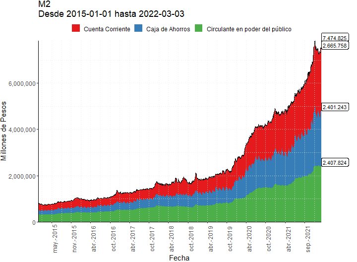
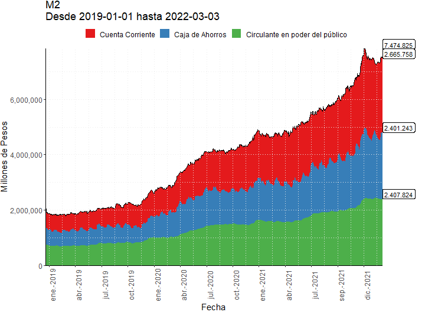
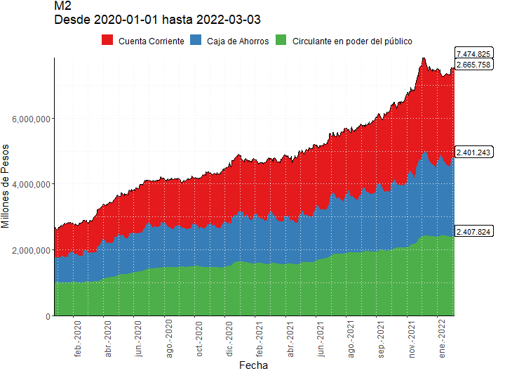
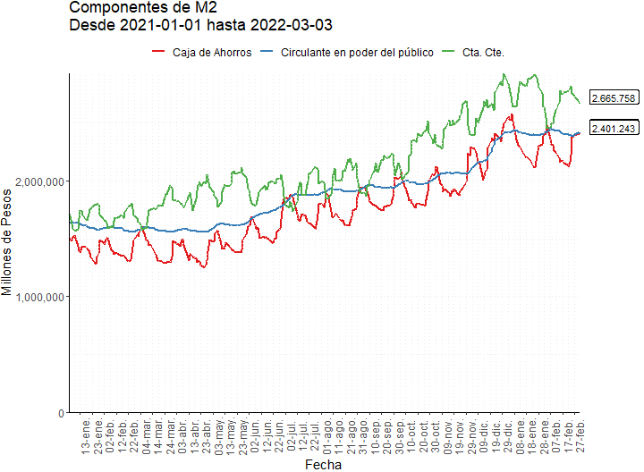
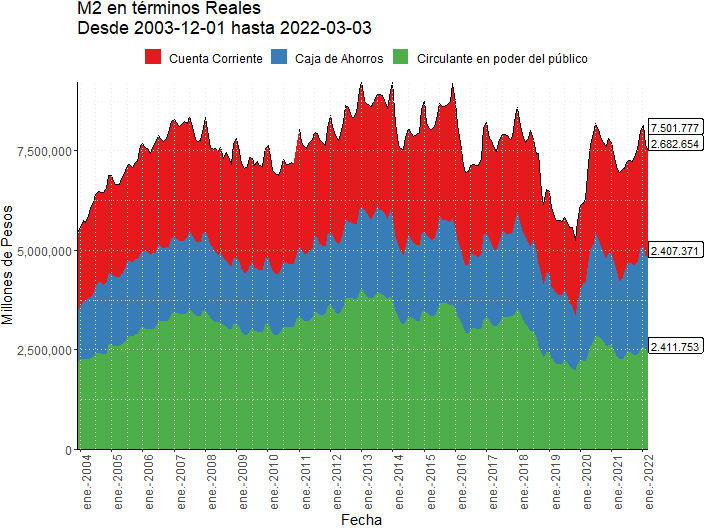
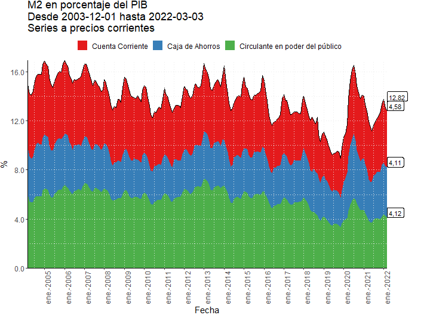
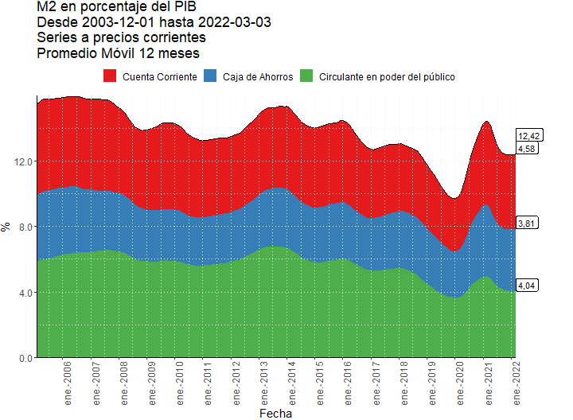
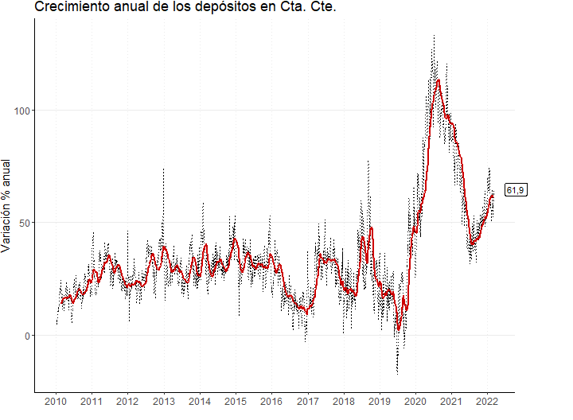
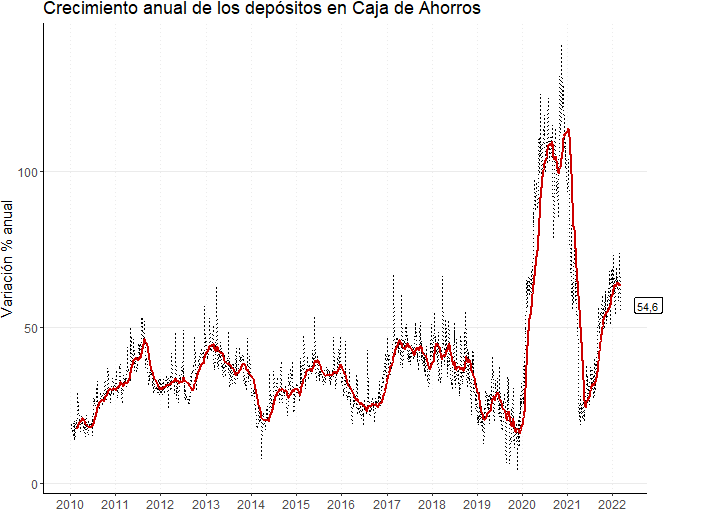

```{r setup, include=FALSE}
knitr::opts_chunk$set(echo = FALSE)
knitr::opts_knit$set(root.dir=normalizePath("."))
```


## M2

<a id="M20"></a>

<br><br><br><br>

### 24

<a href="https://github.com/esterodr/Monitor_v2/blob/main/CSV/Grafico24.csv" target="_blank">Descargar Datos</a>

<a id="M21"></a>

<br><br><br><br>

### 25

<a href="https://github.com/esterodr/Monitor_v2/blob/main/CSV/Grafico25.csv" target="_blank">Descargar Datos</a>

<a id="M22"></a>

<br><br><br><br>

### 26

<a href="https://github.com/esterodr/Monitor_v2/blob/main/CSV/Grafico26.csv" target="_blank">Descargar Datos</a>

<a id="M23"></a>

<br><br><br><br>

### 27

<a href="https://github.com/esterodr/Monitor_v2/blob/main/CSV/Grafico27.csv" target="_blank">Descargar Datos</a>

## Componentes de M2

<a id="M2c0"></a>

<br><br><br><br>

### 28

<a href="https://github.com/esterodr/Monitor_v2/blob/main/CSV/Grafico28.csv" target="_blank">Descargar Datos</a>

<a id="M2c1"></a>

<br><br><br><br>

### 29

<a href="https://github.com/esterodr/Monitor_v2/blob/main/CSV/Grafico29.csv" target="_blank">Descargar Datos</a>

<a id="M2c2"></a>

<br><br><br><br>

### 30

<a href="https://github.com/esterodr/Monitor_v2/blob/main/CSV/Grafico30.csv" target="_blank">Descargar Datos</a>

<a id="M2c3"></a>

<br><br><br><br>

### 31

<a href="https://github.com/esterodr/Monitor_v2/blob/main/CSV/Grafico31.csv" target="_blank">Descargar Datos</a>


## M2 en términos reales y del PIB

<a id="M2_real"></a>

<br><br><br><br>

### 32

<a href="https://github.com/esterodr/Monitor_v2/blob/main/CSV/Grafico32.csv" target="_blank">Descargar Datos</a>

<a id="M2_pib1"></a>

<br><br><br><br>

### 33

<a href="https://github.com/esterodr/Monitor_v2/blob/main/CSV/Grafico33.csv" target="_blank">Descargar Datos</a>

<a id="M2_pib2"></a>

<br><br><br><br>

### 34

<a href="https://github.com/esterodr/Monitor_v2/blob/main/CSV/Grafico34.csv" target="_blank">Descargar Datos</a>

<a id="M2_pib3"></a>

<br><br><br><br>

### 35

<a href="https://github.com/esterodr/Monitor_v2/blob/main/CSV/Grafico35.csv" target="_blank">Descargar Datos</a>

## Crecimiento anual de M2 y sus componentes

<a id="M2_crec_M2"></a>

<br><br><br><br>

### 36

<a href="https://github.com/esterodr/Monitor_v2/blob/main/CSV/Grafico36.csv" target="_blank">Descargar Datos</a>

<a id="M2_crec_circ"></a>

<br><br><br><br>

### 37 

<a href="https://github.com/esterodr/Monitor_v2/blob/main/CSV/Grafico37.csv" target="_blank">Descargar Datos</a>


<a id="M2_crec_cc"></a>

<br><br><br><br>

## 38

<a href="https://github.com/esterodr/Monitor_v2/blob/main/CSV/Grafico38.csv" target="_blank">Descargar Datos</a>

<a id="M2_crec_ca"></a>

<br><br><br><br>

## 39

<a href="https://github.com/esterodr/Monitor_v2/blob/main/CSV/Grafico39.csv" target="_blank">Descargar Datos</a>

