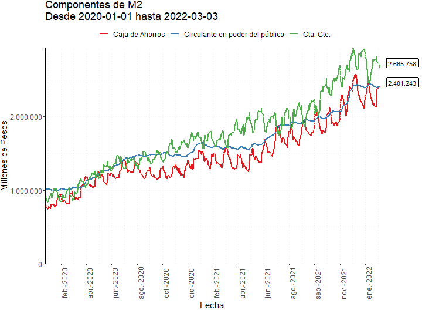
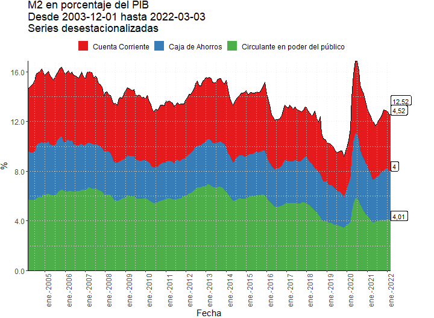

```{r setup, include=FALSE}
knitr::opts_chunk$set(echo = FALSE)
knitr::opts_knit$set(root.dir=normalizePath("."))
```

```{r eval=TRUE}
N <- 23
```

## M2

<a id="M20"></a>

<br><br><br><br>

```{r eval=TRUE}
N <- N+1
link <- paste0("https://github.com/esterodr/Monitor_v2/blob/main/CSV/Grafico",N,".csv")
```
### `r N`
<br>


<div align="center">[Descargar Datos](`r link`){target="_blank"}</div>

<a id="M21"></a>

<br><br><br><br>

```{r eval=TRUE}
N <- N+1
link <- paste0("https://github.com/esterodr/Monitor_v2/blob/main/CSV/Grafico",N,".csv")
```
### `r N`
<br>


<div align="center">[Descargar Datos](`r link`){target="_blank"}</div>

<a id="M22"></a>

<br><br><br><br>

```{r eval=TRUE}
N <- N+1
link <- paste0("https://github.com/esterodr/Monitor_v2/blob/main/CSV/Grafico",N,".csv")
```
### `r N`
<br>


<div align="center">[Descargar Datos](`r link`){target="_blank"}</div>

<a id="M23"></a>

<br><br><br><br>

```{r eval=TRUE}
N <- N+1
link <- paste0("https://github.com/esterodr/Monitor_v2/blob/main/CSV/Grafico",N,".csv")
```
### `r N`
<br>


<div align="center">[Descargar Datos](`r link`){target="_blank"}</div>

<br><br><br><br>

## Componentes de M2

<a id="M2c0"></a>

<br><br><br><br>

```{r eval=TRUE}
N <- N+1
link <- paste0("https://github.com/esterodr/Monitor_v2/blob/main/CSV/Grafico",N,".csv")
```
### `r N`
<br>


<div align="center">[Descargar Datos](`r link`){target="_blank"}</div>

<a id="M2c1"></a>

<br><br><br><br>

```{r eval=TRUE}
N <- N+1
link <- paste0("https://github.com/esterodr/Monitor_v2/blob/main/CSV/Grafico",N,".csv")
```
### `r N`
<br>


<div align="center">[Descargar Datos](`r link`){target="_blank"}</div>

<a id="M2c2"></a>

<br><br><br><br>

```{r eval=TRUE}
N <- N+1
link <- paste0("https://github.com/esterodr/Monitor_v2/blob/main/CSV/Grafico",N,".csv")
```
### `r N`
<br>


<div align="center">[Descargar Datos](`r link`){target="_blank"}</div>

<a id="M2c3"></a>

<br><br><br><br>

```{r eval=TRUE}
N <- N+1
link <- paste0("https://github.com/esterodr/Monitor_v2/blob/main/CSV/Grafico",N,".csv")
```
### `r N`
<br>


<div align="center">[Descargar Datos](`r link`){target="_blank"}</div>

<br><br><br><br>

## M2 en términos reales y del PIB

<a id="M2_real"></a>

<br><br><br><br>

```{r eval=TRUE}
N <- N+1
link <- paste0("https://github.com/esterodr/Monitor_v2/blob/main/CSV/Grafico",N,".csv")
```
### `r N`
<br>


<div align="center">[Descargar Datos](`r link`){target="_blank"}</div>

<a id="M2_pib1"></a>

<br><br><br><br>

```{r eval=TRUE}
N <- N+1
link <- paste0("https://github.com/esterodr/Monitor_v2/blob/main/CSV/Grafico",N,".csv")
```
### `r N`
<br>


<div align="center">[Descargar Datos](`r link`){target="_blank"}</div>

<a id="M2_pib2"></a>

<br><br><br><br>

```{r eval=TRUE}
N <- N+1
link <- paste0("https://github.com/esterodr/Monitor_v2/blob/main/CSV/Grafico",N,".csv")
```
### `r N`
<br>


<div align="center">[Descargar Datos](`r link`){target="_blank"}</div>

<a id="M2_pib3"></a>

<br><br><br><br>

```{r eval=TRUE}
N <- N+1
link <- paste0("https://github.com/esterodr/Monitor_v2/blob/main/CSV/Grafico",N,".csv")
```
### `r N`
<br>


<div align="center">[Descargar Datos](`r link`){target="_blank"}</div>

<br><br><br><br>

## Crecimiento anual de M2 y sus componentes

<a id="M2_crec_M2"></a>

<br><br><br><br>

```{r eval=TRUE}
N <- N+1
link <- paste0("https://github.com/esterodr/Monitor_v2/blob/main/CSV/Grafico",N,".csv")
```
### `r N`
<br>


<div align="center">[Descargar Datos](`r link`){target="_blank"}</div>

<a id="M2_crec_circ"></a>

<br><br><br><br>

```{r eval=TRUE}
N <- N+1
link <- paste0("https://github.com/esterodr/Monitor_v2/blob/main/CSV/Grafico",N,".csv")
```
### `r N`
<br>


<div align="center">[Descargar Datos](`r link`){target="_blank"}</div>


<a id="M2_crec_cc"></a>

<br><br><br><br>

```{r eval=TRUE}
N <- N+1
link <- paste0("https://github.com/esterodr/Monitor_v2/blob/main/CSV/Grafico",N,".csv")
```
### `r N`
<br>


<div align="center">[Descargar Datos](`r link`){target="_blank"}</div>

<a id="M2_crec_ca"></a>

<br><br><br><br>

```{r eval=TRUE}
N <- N+1
link <- paste0("https://github.com/esterodr/Monitor_v2/blob/main/CSV/Grafico",N,".csv")
```
### `r N`
<br>


<div align="center">[Descargar Datos](`r link`){target="_blank"}</div>

